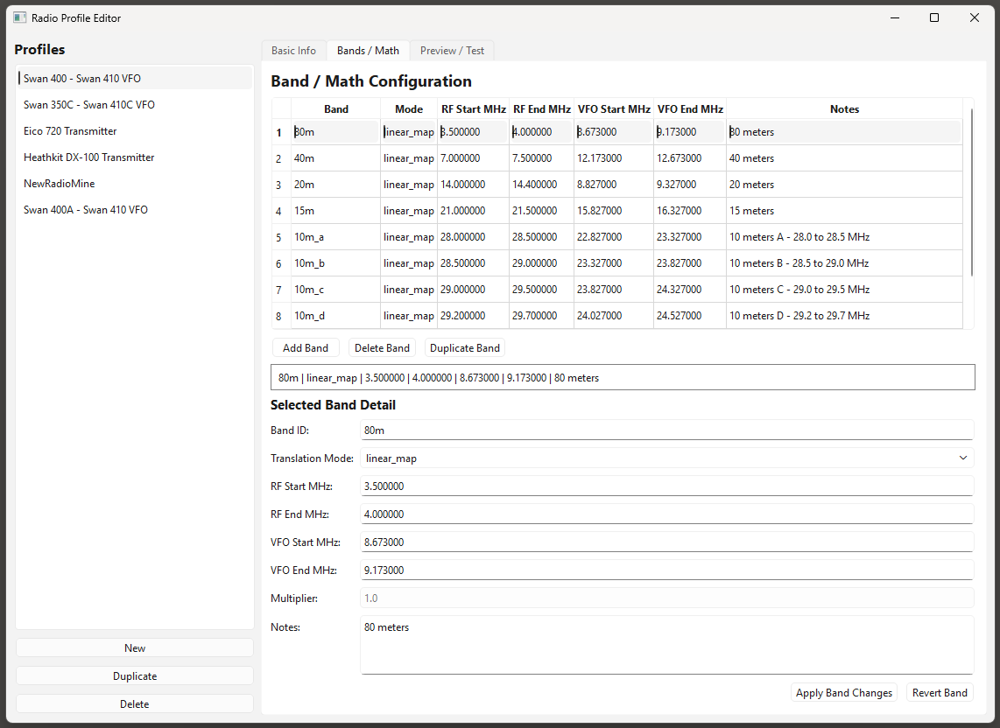
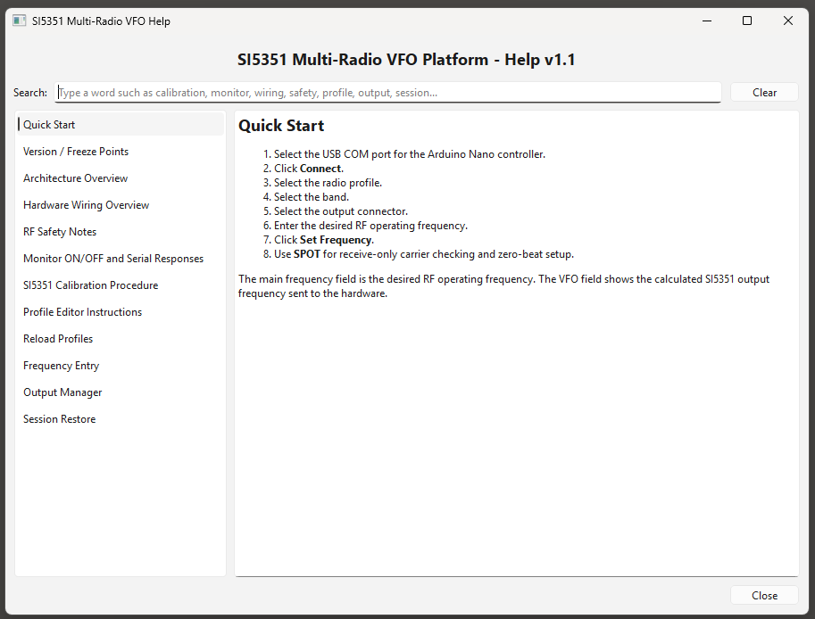
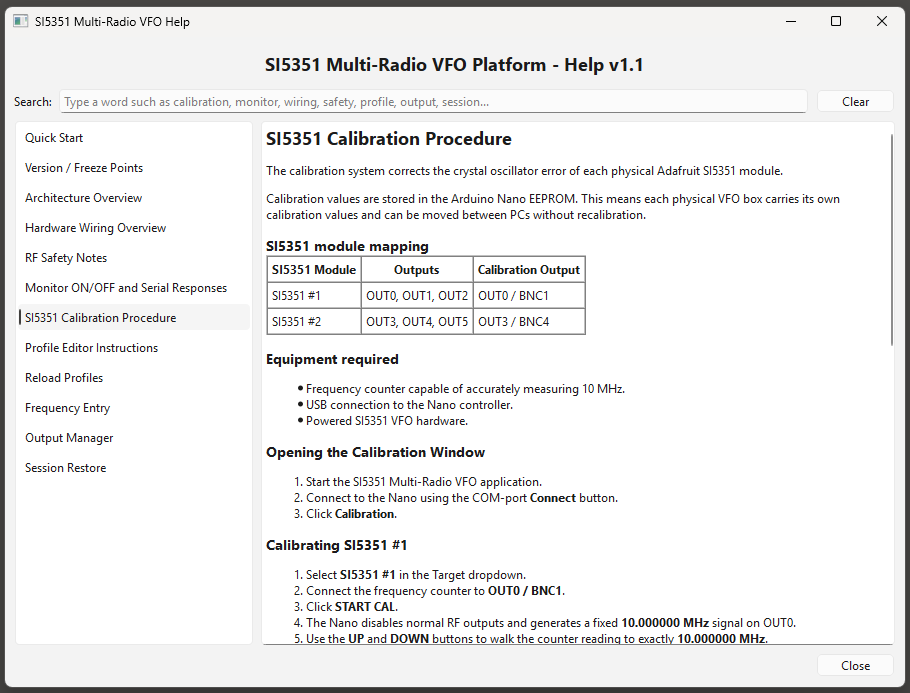
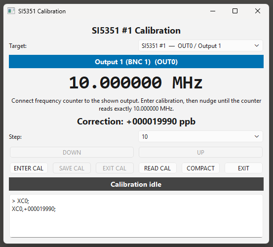

# SI5351 Multi-Radio VFO Control Platform

PC-Controlled Multi-Radio Frequency Synthesizer Platform for Vintage Amateur Radio Equipment

---

# Project Overview

The SI5351 Multi-Radio VFO Control Platform is a modular RF frequency-control system designed for vintage amateur radio transmitters and transceivers.

The platform combines:

* Arduino Nano firmware
* Multiple Adafruit SI5351 synthesizer modules
* TCA9548A I2C expansion
* PySide6 desktop GUI
* Radio profile translation system
* Multi-window radio operation
* EEPROM calibration architecture
* RF output management
* Session persistence

The system is intended to replace or emulate:

* crystal oscillators
* external VFOs
* local oscillators
* frequency control units

for vintage amateur radio equipment.

The project evolved beyond a simple SI5351 frequency generator into a configurable RF instrumentation and radio-control platform.

---

# Current Stable Freeze Point

```text
SI5351_VFO_PLATFORM_v6_INSTALLER_VALIDATED
SI5351_VFO_MAIN_WINDOW_v9E_690PX_STABLE
```

Validated:

* Windowed PyInstaller deployment
* Inno Setup installer deployment
* Desktop shortcut installation
* Calibration subsystem
* Profile Editor subsystem
* Help subsystem
* Multi-window operation
* Session persistence
* COM reconnect behavior
* Output Manager subsystem

---

# Downloads

## Latest Public Release

The latest installer package and printable PDF User Manual are available from the GitHub Releases page:

[Download Latest Release](../../releases/latest)

Included release assets:

* Windows Installer EXE
* Printable PDF User Manual
* Source Code Archives

Current stable release:

```text id="c1p4za"
SI5351 Multi-Radio VFO v6.0
```

---

# Windows SmartScreen Notice

Because this project is independently developed open-source software, Windows SmartScreen or Microsoft Edge may display a warning such as:

```text id="9tz6cw"
"This app isn't commonly downloaded"
```

This is normal for newly released independent software that does not yet have widespread Microsoft reputation data or commercial code-signing certificates.

The installer is:

* open-source
* publicly auditable on GitHub
* distributed directly from this repository
* built from the included source code

Typical user workflow:

1. Download the installer from the official GitHub Releases page.
2. If SmartScreen appears:

   * click `More info`
   * then click `Run anyway`
  
   * OR

* Click:  '...'
* or Keep
* then:
* Keep anyway
* or More info → Run anyway

* Depending on browser/version.

As more users download and use the installer, Microsoft reputation scoring typically improves over time.

---

# Major Features

## Multi-Radio Architecture

Supports multiple simultaneous radio-control windows.

Each window can independently:

* select a radio profile
* select RF band
* select output channel
* tune frequencies
* control SPOT mode
* display translated VFO frequencies

---

## Multi-Output RF Architecture

Supports:

```text
OUT0 through OUT5
```

Using:

* Arduino Nano
* TCA9548A I2C multiplexer
* Two Adafruit SI5351 modules

Current output mapping:

```text
OUT0 = SI5351 #1 CLK0
OUT1 = SI5351 #1 CLK1
OUT2 = SI5351 #1 CLK2
OUT3 = SI5351 #2 CLK0
OUT4 = SI5351 #2 CLK1
OUT5 = SI5351 #2 CLK2
```

---

## Radio Profile Translation System

The GUI performs all radio-frequency translation math.

Supported radio models currently include:

* Swan 400
* Swan 350C
* Heathkit DX-100
* Eico 720
* additional profiles can be added

Supported translation modes:

* direct
* linear_map
* multiply

---

# Calibration Subsystem

The platform includes a complete EEPROM-based SI5351 calibration architecture.

Each physical Nano/SI5351 unit stores its own calibration values locally in Nano EEPROM.

This allows:

* swapping physical VFO units between computers
* preserving correction values per hardware unit
* automatic correction restoration at startup

---

## Calibration Workflow

1. Connect a precision frequency counter to the selected output.
2. Open the Calibration Window.
3. Select SI5351 #1 or #2.
4. Enter calibration mode.
5. The system outputs:

```text
10.000000 MHz
```

6. Adjust correction using UP/DOWN controls.
7. Observe frequency counter.
8. Tune until counter reads exactly:

```text
10.000000 MHz
```

9. Save calibration.
10. Calibration automatically restores at future startup.

---

# Monitor Mode Clarification

The Monitor ON/OFF button controls the serial monitor visibility.

Important:

```text
ID Test
Read Calibration
Calibration command responses
```

are visible only when:

```text
Monitor ON
```

is enabled.

This is intentional and prevents unnecessary serial output during normal operation.

---

# Main Window

Main operating console.

Features:

* COM connection management
* frequency display
* RF status display
* RX/TX indicators
* Output assignment
* session management
* calibration access
* profile editor access
* help system access

Screenshot:


---

# Compact Radio Window

Compact operating window for multi-radio operation.

Features:

* reduced screen footprint
* fast tuning workflow
* output assignment
* SPOT control
* TX/RX status

Screenshot:


---

# Output Manager

Centralized output routing display.

Displays:

* OUT0–OUT5 assignments
* radio ownership
* RF state
* SPOT state
* TX state

Screenshot:


---

# Profile Editor

Graphical editor for:

* radio definitions
* translation modes
* band maps
* VFO calculations

Features:

* validation checking
* dirty-state tracking
* profile reload support
* JSON profile editing without manual editing

Screenshot:



---

# Help System

Integrated searchable help system.

Includes:

* quick-start guide
* calibration instructions
* monitor clarification
* profile editor instructions
* architecture notes
* safety notes

Screenshots:





---

# Session Persistence

The platform automatically saves and restores:

* window positions
* compact/full modes
* selected radios
* selected outputs
* frequency states
* tuning step sizes

Startup safety behavior:

```text
RF outputs always restore OFF
```

This prevents accidental RF transmission after restart.

---

# Hardware Architecture

Current hardware platform:

* Arduino Nano ATmega328
* TCA9548A I2C multiplexer
* Two Adafruit SI5351 modules
* USB serial interface
* Multiple RF outputs
* PTT input architecture

Future expansion areas:

* RF switching
* external filters
* relay sequencing
* panadapter support
* RF amplifier modules
* additional synthesizer boards

---

# Screenshots

## Main Window


---

## Compact Window


---

## Calibration Window



---

## Output Manager


---

## Multi-Window Operation


---

## Profile Editor


---

## Help System


---

# Installer Deployment

The project includes:

* PyInstaller deployment
* Inno Setup installer
* Desktop shortcut support
* packaged Qt runtime
* packaged support files

Deployment status:

```text
INSTALLER VALIDATED
```

---

# Development Environment

## PC Software

* Python 3.x
* PySide6
* PyInstaller
* Inno Setup

## Firmware

* Arduino Nano
* AVR platform
* EEPROM calibration architecture

---

# Future Roadmap

Planned future development:

* advanced profile management
* RF output filtering
* relay sequencer subsystem
* AirSpy panadapter integration
* expanded radio-profile database
* printable operating manual
* hardware carrier PCB
* enclosure development
* enhanced session profiles

---

# Author

John Bielefeld - K1JEB

---

# License

Project currently in active hobby-development phase.

License selection pending.
