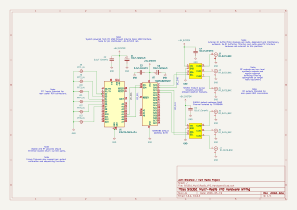
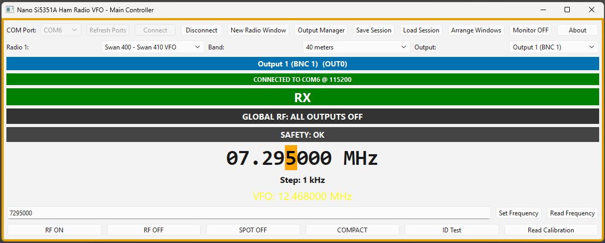
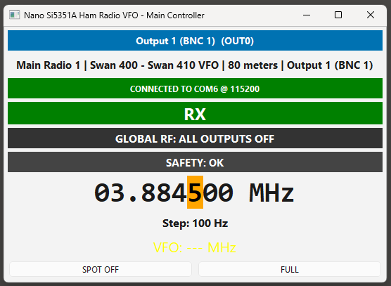
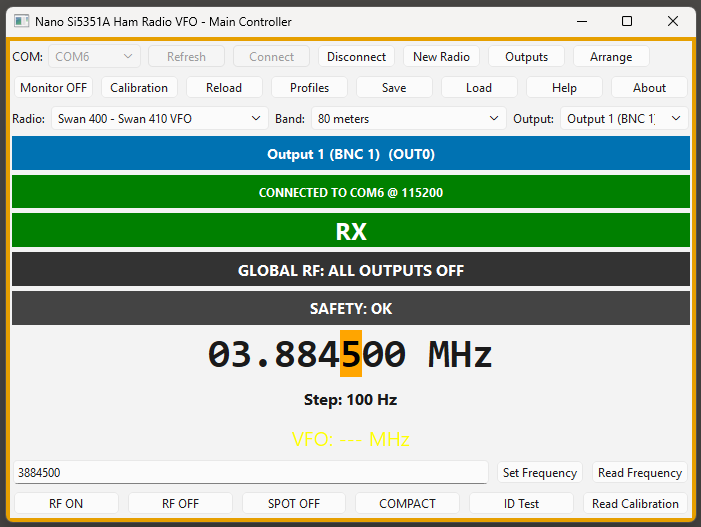
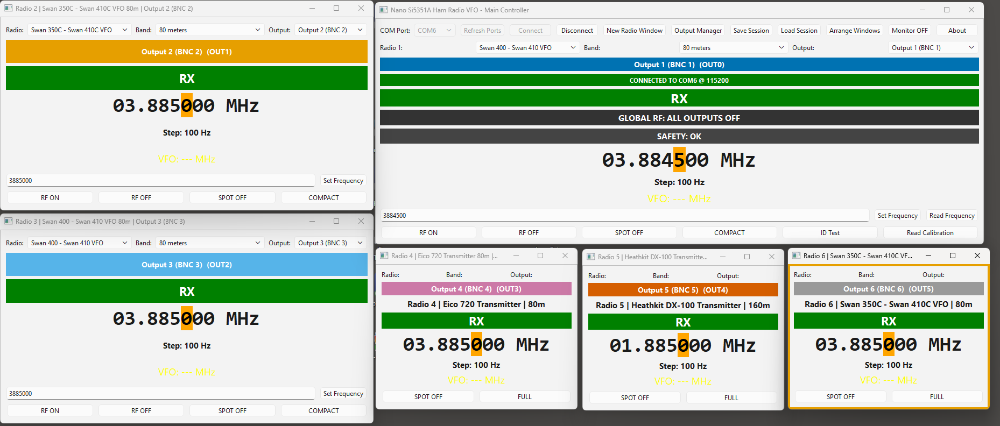
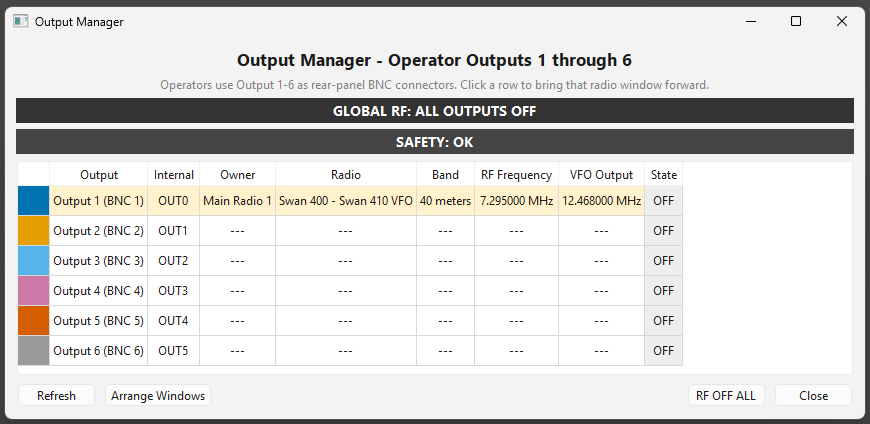
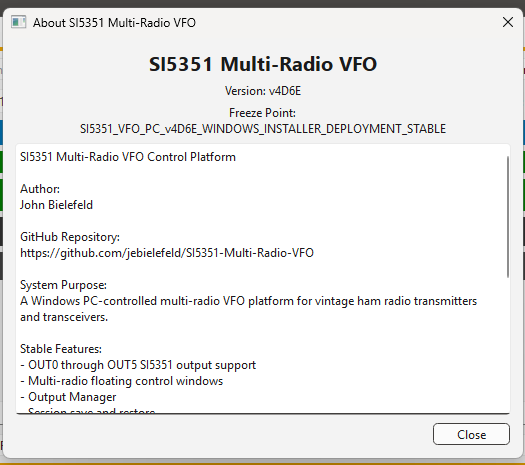

# SI5351 Multi-Radio VFO Control System

A multi-output synthesized VFO platform for vintage amateur radio equipment using an Arduino Nano, dual SI5351 synthesizers, and a PySide6 desktop control application.

---

# Current Release Status

**v0.9.0-beta**

The software is currently in active beta development and has been validated for:

- Windows desktop deployment
- installer-based installation
- session persistence
- multi-window operation
- COM reconnect after reboot
- dual SI5351 operation
- OUT0–OUT5 routing architecture

---

# Overview

The SI5351 Multi-Radio VFO Control System replaces unstable analog VFOs and crystal oscillators with digitally synthesized RF sources controlled from a Windows desktop application.

The project was designed specifically for vintage amateur radio transmitters and transceivers that require stable external VFO or LO signals.

The system supports:

- multiple simultaneous radio control windows
- multiple RF outputs
- radio-specific frequency translation
- session persistence
- RF output routing
- desktop operating control

The architecture separates:

- GUI intelligence and radio math
- hardware execution
- RF output management
- session management
- radio profile configuration

---

# Why This Project Exists

Many classic amateur radio transmitters and transceivers suffer from:

- VFO drift
- aging analog oscillators
- unavailable crystals
- expensive original external VFO units
- unstable warm-up behavior

This project provides:

- stable synthesized frequency generation
- modern desktop operating convenience
- support for multiple vintage radios simultaneously
- configurable radio translation profiles
- compact external VFO replacement capability

The system is intended for:

- vintage ham radio restoration
- multi-radio operating desks
- bench/lab signal generation
- external VFO replacement
- synthesized local oscillator experimentation

---

# Major Features

- Multi-radio simultaneous control
- 6 independent RF outputs (OUT0–OUT5)
- Dual SI5351 synthesizer support
- TCA9548A I2C multiplexer architecture
- Floating radio control windows
- Compact and full operating modes
- Session save/restore
- Output conflict prevention
- RF ON/OFF control
- PTT/TX/RX synchronization
- SPOT mode support
- Radio profile translation system
- PyInstaller standalone EXE support
- Inno Setup installer support

---

# Hardware Architecture

The SI5351 Multi-Radio VFO platform is a USB-powered RF synthesis and control system intended for vintage radio experimentation and multi-radio frequency generation.

The platform provides:

- Multi-output SI5351 RF synthesis
- TCA9548A I2C expansion
- Independent RF outputs
- PTT awareness inputs
- USB PC control through Arduino Nano
- Radio-profile-based frequency translation

The platform intentionally excludes radio-specific RF conditioning hardware.

External modules provide:

- RF buffering
- filtering
- level conversion
- radio-specific drive adaptation

## Hardware Architecture Schematic



## Architecture Notes

- USB power is distributed through the Arduino Nano 5V rail
- SI5351 modules are isolated through the TCA9548A I2C multiplexer
- RF outputs are intended for rear-panel BNC connectors
- PTT inputs are intended for rear-panel RCA connectors
- RF buffering/filtering is intentionally external to the platform

# Screenshots

## Main Window



---

## Compact Radio Window



---

## Full Radio Window



---

## Multi-Window Operating Layout



---

## Output Manager



---

## About Dialog



---

# Hardware Architecture

## Controller

- Arduino Nano

## I2C Multiplexer

- TCA9548A @ 0x70

## RF Synthesizers

- 2 × Adafruit SI5351A modules

Each SI5351 provides:

- CLK0
- CLK1
- CLK2

Total outputs:

- OUT0–OUT5

---

# Output Mapping

| Output | Hardware |
|---|---|
| OUT0 | SI5351 #1 CLK0 |
| OUT1 | SI5351 #1 CLK1 |
| OUT2 | SI5351 #1 CLK2 |
| OUT3 | SI5351 #2 CLK0 |
| OUT4 | SI5351 #2 CLK1 |
| OUT5 | SI5351 #2 CLK2 |

GUI labels:

- BNC1–BNC6

---

# Supported Radios

| Radio | Translation Model |
|---|---|
| Swan 400 | linear_map |
| Swan 350C | linear_map |
| Eico 720 | multiply |
| Heathkit DX-100 | multiply/direct |
| Clegg Thor 6 | direct |

Additional radio profiles can be added through the profile system.

---

# Software Architecture

## Python GUI = System Brain

The PySide6 GUI performs:

- radio profile math
- frequency translation
- session management
- output assignment
- multi-window coordination
- serial communication management

## Arduino Nano = Execution Engine

The Arduino Nano performs:

- SI5351 frequency programming
- RF output switching
- PTT state reporting
- hardware-level execution only

Important architectural rule:

> Radio frequency translation logic remains in Python and is NOT performed in the Arduino firmware.

---

# Serial Protocol

## Frequency Commands

```text
F0xxxxxxxxxxx;
F1xxxxxxxxxxx;
F2xxxxxxxxxxx;
F3xxxxxxxxxxx;
F4xxxxxxxxxxx;
F5xxxxxxxxxxx;